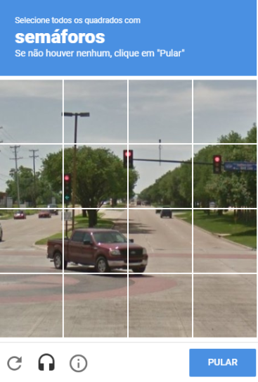
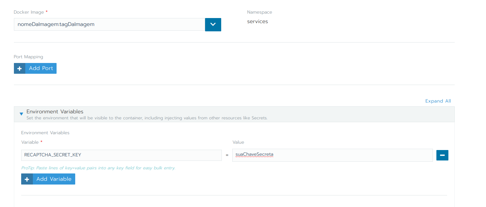
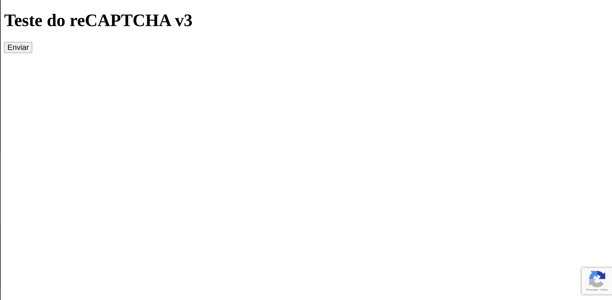
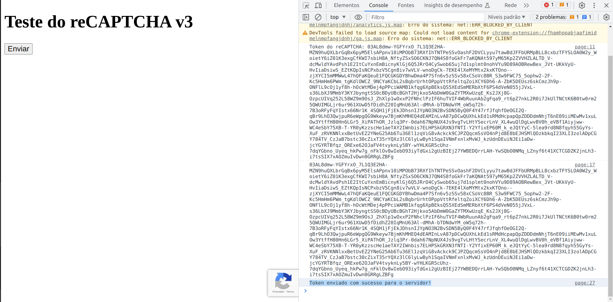
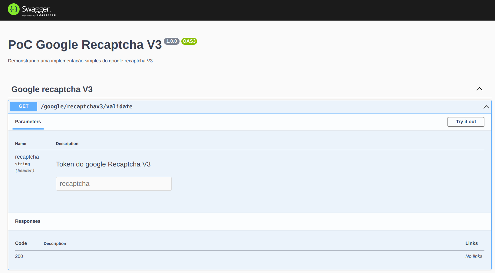
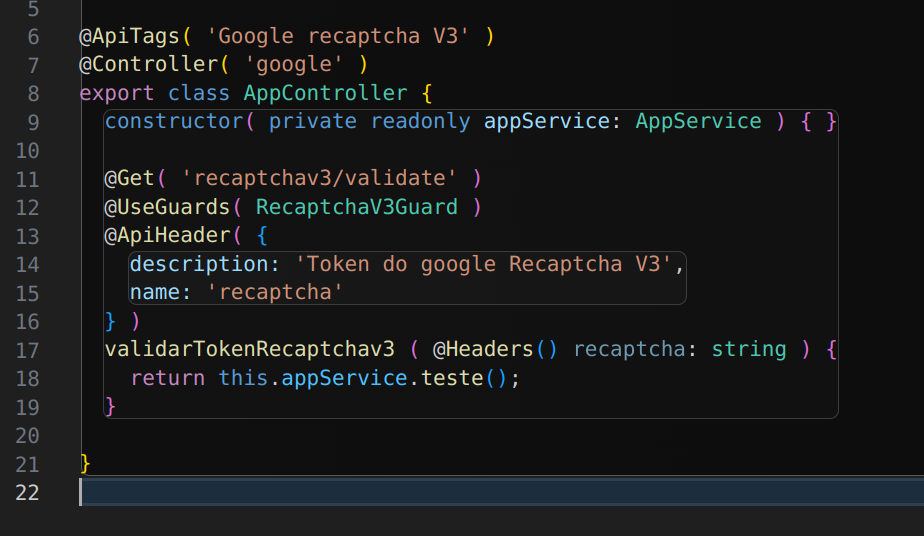

# POC GOOGLE RECAPTCHA V3

POC demonstrando uma implementação do Google Recaptcha V3 para proteger um endpoint de uma API construida com Nestjs

## Sobre esta PoC

Mecanismos de prevenção de automatização como o tradicional recaptcha já são bem conhecidos, seu principal ponto negativo está no fato de que o cliente é forçado a resolver um desafio que pode ser irritante, para só então conseguir acessar o recurso protegido.



A Google possui uma versão desse mecanismo baseada em I.A, que analisa o comportamento do usuario no site e com base nisso atribui uma pontuação, o backend de seu sistema analisa essa pontuação e determina se aquele acesso é suficientemente "humano" ou não, e com base nisso ele libera ou bloqueia o acesso ao recurso. O usuário não precisa mais resolver nenhum desafio, sendo o recaptcha V3 totalmente transparente para ele.

Esta PoC visa demonstrar como isso funciona usando uma aplicação em Nestjs.

## INSTRUÇÕES DE USO
O cadastro da aplicação no painel do desenvolvedor do google exige um nome de domínio. Logo, para que a PoC funcione, você precisa fazer o deploy dela em um servidor de aplicação que hospede esse domínio.


### Aplicação cadastrada no google com uma conta válida

Cadastre sua aplicação em https://www.google.com/recaptcha

Você precisará informar o domínio onde hospedará a aplicação e receberá duas chaves: uma chave do site e uma chave secreta para o backend

### Configuração das chaves da aplicação no backend e no frontend

Abra o arquivo testPage.html e substitua o valor <site_key> pela sua chave do site.

Passe a variavel de ambiente RECAPTCHA_SECRET_KEY para o seu pod com a chave secreta

### Build da imagem docker e deploy em um servidor que hospede o domínio da aplicação registrada no Google

Faça o build da imagem docker deste projeto

```sh
docker build -t nomeDaImagem:tagDaImagem .
```

Envie a imagem para o seu registry

```sh
docker push nomeDaImagem:tagDaImagem
```

Faça o deploy da imagem passando a variavel de ambiente. Por exemplo, no rancher você deve fazer assim:



Faça os apontamentos de dominio para esse pod apontando para a porta 4000 (A api roda na porta 3000 mas o que vamos validar está no front, que roda na 4000 nesse mesmo pod.)

Ao acessar o site, você deverá ver essa página de teste:



O botão enviar envia para nosso backend o token do captcha resolvido para a avaliação do score

Ao clicar no enviar, se você abrir o console verá esses logs:




### Backend

Nosso backend tem um endpoint documentado via swagger:



Como ilustrado no swagger, o endpoint espera um header chamado 'recaptcha' contendo o token da validação gerada no front.

Um serviço faz a comunicação com o google, esse serviço é injetado em um guard, contendo uma lógica de validação. Esse guard então é adicionado como um decorator no controller, acima do endpoint que deve ser protegido.


